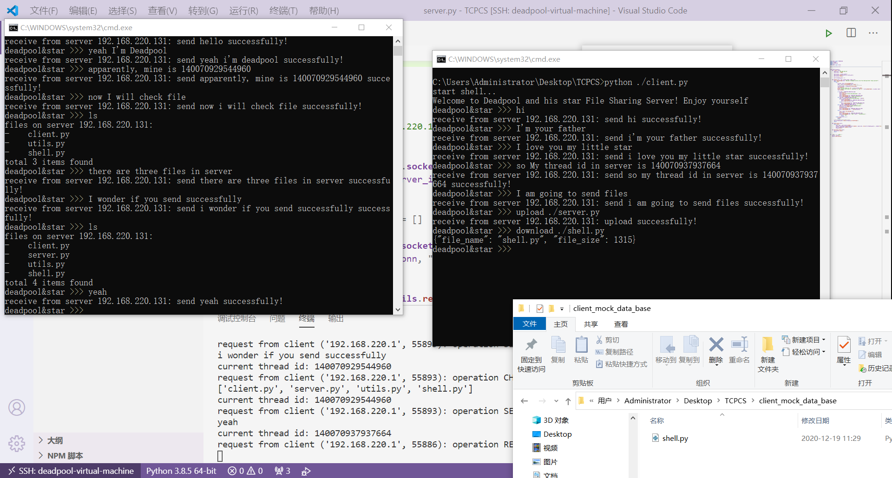
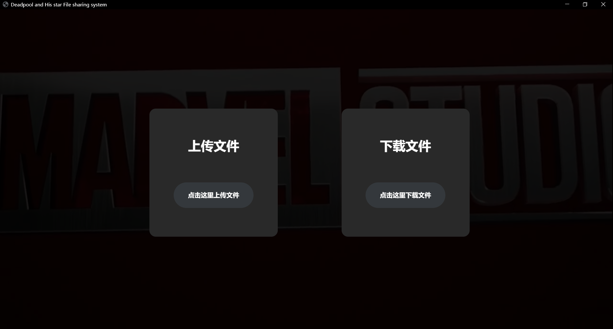
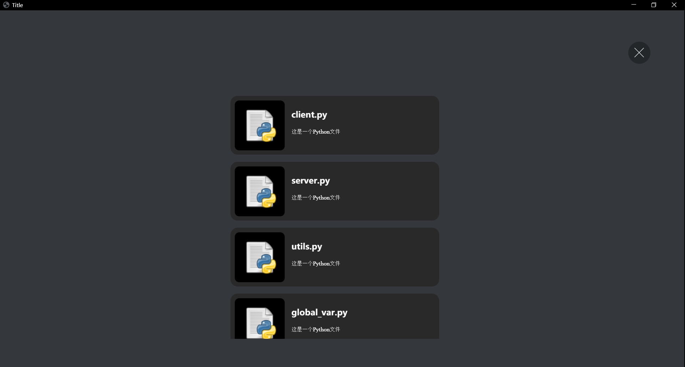

# HITSZ-ComupterNetwork

## TCPCS(TCP client / server)
### Shell based interaction

--- 
Suppoert command:

- ls:check server files, default in directory "server_mock_data_base"
- upload:upload files in current folder, for now
- download:download files in "server_mock_data_base"
- gui/ui:open gui 

### Cool GUI

## Lab

